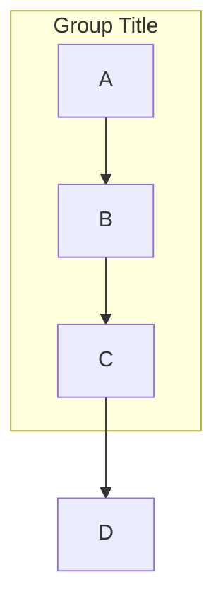
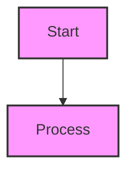
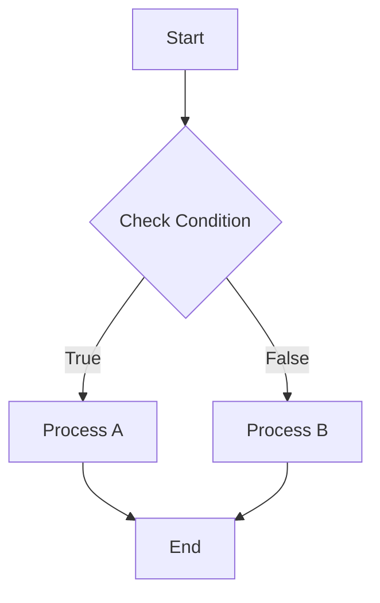
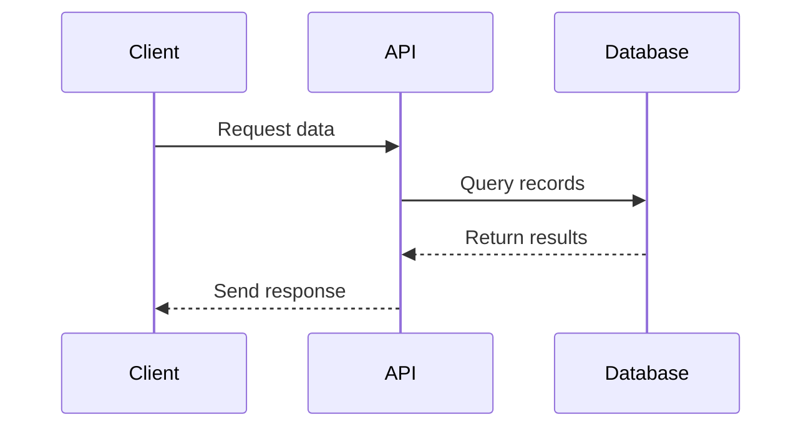
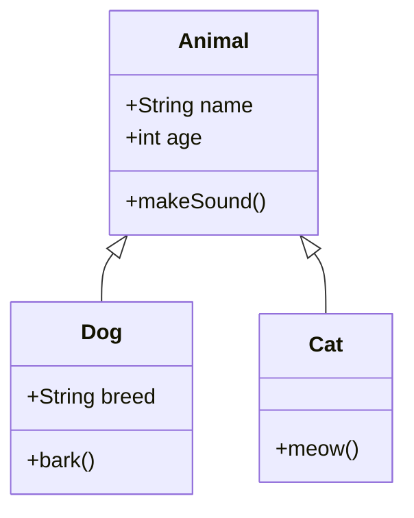

## Prerequisites

This skill requires `mmdc` (mermaid-cli) to be installed. If you don't have it installed, please run:

```bash
npm install -g @mermaid-js/mermaid-cli
```

## When to Use This Skill

When asked to create a Mermaid diagram, follow this workflow:

1. **Analyze the request** - Determine the most appropriate diagram type
2. **Generate clean Mermaid syntax**
3. **Validate the syntax** using temporary files
4. **Present the validated diagram** with brief explanation

## Diagram Types

Choose the appropriate diagram type based on the use case:

- `flowchart`/`graph` - For processes and relationships
- `sequenceDiagram` - For interactions over time
- `classDiagram` - For software architecture and class relationships
- `gantt` - For project timelines and schedules
- `pie` - For data visualization and proportions
- `stateDiagram` - For state machines
- `erDiagram` - For entity relationships

## Mermaid Syntax Reference

### Node Syntax

```mermaid
A[Square/Rectangle]
B(Rounded rectangle)
C{Decision/Diamond}
D((Circle))
E>Flag/Asymmetric hexagon]
F{{Hexagon}}
G[/Parallelogram/]
H[\Parallelogram\]
I[[Subroutine]]
J[(Database)]
```

### Connection Syntax

```mermaid
A --> B              # Arrow
A -->|Text| B        # Arrow with label
A -.-> B             # Dotted arrow
A ==> B              # Thick arrow
A --- B              # Line (three dashes)
A -- Text --- B      # Line with text
A -.->|Text| B       # Dotted arrow with label
```

### Subgraphs



### Styling



### High Contrast Colors

**Prefer vivid, high contrast color combinations** for better readability and accessibility:

**Good High Contrast Examples:**


**Vivid Color Combinations with High Contrast:**
- Background: `#0066ff` (bright blue), Text: `#ffffff` (white)
- Background: `#cc0000` (vivid red), Text: `#ffffff` (white)
- Background: `#6600cc` (deep purple), Text: `#ffffff` (white)
- Background: `#00aa00` (vivid green), Text: `#ffffff` (white)
- Background: `#ff6600` (bright orange), Text: `#ffffff` (white)
- Background: `#ffdd00` (bright yellow), Text: `#000000` (black)
- Background: `#00cccc` (bright cyan), Text: `#000000` (black)
- Background: `#ff0099` (vivid magenta), Text: `#ffffff` (white)

**Avoid Low Contrast Combinations:**
- Background: `#cccccc` (light gray), Text: `#ffffff` (white)
- Background: `#f9f` (light pink), Text: `#fff` (white)
- Background: `#e0e0e0` (gray), Text: `#999999` (medium gray)
- Background: `#ffcccc` (pale red), Text: `#ffffff` (white)

## Validation Workflow

### Quick Validation (Portable - Works on macOS and Linux)

Use this one-liner to validate Mermaid syntax with automatic cleanup:

```bash
# Create temp files with proper extensions
TEMP_MMD=$(mktemp /tmp/mermaid.XXXXXX.mmd)
TEMP_OUT=$(mktemp /tmp/mermaid-out.XXXXXX.svg)

# Write diagram to temp file
cat > "$TEMP_MMD" << 'EOF'
graph TD
    A[Start] --> B{Decision}
    B -->|Yes| C[Action]
    B -->|No| D[End]
    C --> D
EOF

# Validate (mmdc exits 0 on success, non-zero on error)
if mmdc -i "$TEMP_MMD" -o "$TEMP_OUT" -q 2>/dev/null; then
    echo "✅ Valid Mermaid syntax"
else
    echo "❌ Invalid Mermaid syntax"
    mmdc -i "$TEMP_MMD" -o "$TEMP_OUT" 2>&1  # Show error details
fi

# Cleanup
rm "$TEMP_MMD" "$TEMP_OUT" 2>/dev/null
```

### Validation Function (For Repeated Use)

```bash
validate_mermaid() {
    local mermaid_code="$1"
    local temp_mmd=$(mktemp /tmp/mermaid.XXXXXX.mmd)
    local temp_out=$(mktemp /tmp/mermaid-out.XXXXXX.svg)

    echo "$mermaid_code" > "$temp_mmd"

    if mmdc -i "$temp_mmd" -o "$temp_out" -q 2>/dev/null; then
        echo "✅ Mermaid syntax is valid"
        rm "$temp_mmd" "$temp_out"
        return 0
    else
        echo "❌ Mermaid syntax error:"
        mmdc -i "$temp_mmd" -o "$temp_out" 2>&1
        rm "$temp_mmd" "$temp_out" 2>/dev/null
        return 1
    fi
}

# Usage
validate_mermaid "graph TD; A-->B;"
```

### Validating from stdin

```bash
# Pipe diagram from stdin
echo "graph TD; A-->B;" | mmdc -i - -o /tmp/test.svg && echo "✅ Valid" || echo "❌ Invalid"

# Using heredoc
mmdc -i - -o /tmp/test.svg << 'EOF'
graph TD
    A[Start] --> B[End]
EOF
```

## Common Errors and Fixes

### Syntax Issues

**Missing message text in sequence diagrams**
```mermaid
# ❌ WRONG - Missing message text
sequenceDiagram
    A->>B

# ✅ CORRECT - Include message
sequenceDiagram
    A->>B: Request data
    B->>A: Return response
```

**Invalid characters in node IDs**
- Use only letters, numbers, underscores: `node_1`, `nodeA`, `step2`
- Avoid spaces, hyphens in IDs: `my-node` (use `my_node` instead)

**Unclosed subgraphs**
```mermaid
# ❌ WRONG - Missing 'end'
subgraph Group
    A --> B

# ✅ CORRECT
subgraph Group
    A --> B
end
```

**Incorrect line syntax**
```mermaid
# ❌ WRONG - Two dashes don't work
A -- B

# ✅ CORRECT - Use three dashes
A --- B

# ✅ CORRECT - Arrow works with two dashes
A --> B
```

### Validation Issues

**Puppeteer/Chrome issues**
- mermaid-cli requires Puppeteer (includes Chrome)
- See [Linux sandbox issue](https://github.com/mermaid-js/mermaid-cli/blob/master/docs/linux-sandbox-issue.md)
- See [Docker permission denied issue](https://github.com/mermaid-js/mermaid-cli/blob/master/docs/docker-permission-denied.md)

**Output file extension required**
```bash
# ❌ WRONG - No extension or invalid path
mmdc -i input.mmd -o /dev/null

# ✅ CORRECT - Use valid extension
mmdc -i input.mmd -o output.svg  # or .png, .pdf, .md
```

## Platform Compatibility Notes

### macOS vs Linux Differences

**mktemp syntax**
- ❌ GNU/Linux only: `mktemp --suffix=.mmd`
- ✅ Portable (macOS/Linux): `mktemp /tmp/mermaid.XXXXXX.mmd`

**Cleanup recommendations**
- Always use `2>/dev/null` when removing temp files to suppress errors
- Example: `rm "$TEMP_FILE" 2>/dev/null`

## Example Workflows

### Creating a Flowchart

1. **Generate the diagram**:



2. **Validate with portable command**:

```bash
TEMP_MMD=$(mktemp /tmp/mermaid.XXXXXX.mmd)
TEMP_OUT=$(mktemp /tmp/mermaid-out.XXXXXX.svg)

cat > "$TEMP_MMD" << 'EOF'
flowchart TD
    A[Start] --> B{Check Condition}
    B -->|True| C[Process A]
    B -->|False| D[Process B]
    C --> E[End]
    D --> E
EOF

mmdc -i "$TEMP_MMD" -o "$TEMP_OUT" -q && echo "✅ Valid" || echo "❌ Invalid"
rm "$TEMP_MMD" "$TEMP_OUT" 2>/dev/null
```

### Creating a Sequence Diagram



### Creating a Class Diagram



## Output Format

When presenting validated diagrams:

1. Provide the Mermaid code in a code block with \`\`\`mermaid
2. Include brief explanation of the diagram structure
3. Mention validation result: "✅ Valid Mermaid syntax"
4. For errors, show the specific error message from mmdc

## Command Line Options

Useful mmdc flags:

- `-i, --input <file>` - Input file (use `-` for stdin)
- `-o, --output <file>` - Output file (.svg, .png, .pdf, .md)
- `-t, --theme <theme>` - Theme (default, dark, forest, neutral)
- `-b, --backgroundColor <color>` - Background color (e.g., transparent, white, #f0f0f0)
- `-q, --quiet` - Suppress log output (useful for validation scripts)
- `-c, --configFile <file>` - JSON configuration file
- `--cssFile <file>` - Inline custom CSS

Example with options:
```bash
mmdc -i input.mmd -o output.png -t dark -b transparent -q
```

## References

- [Official Mermaid CLI Documentation](https://github.com/mermaid-js/mermaid-cli)
- [Mermaid Syntax Guide](https://mermaid.js.org/syntax/)
- [Mermaid Live Editor](https://mermaid.live/) - Test diagrams in browser
