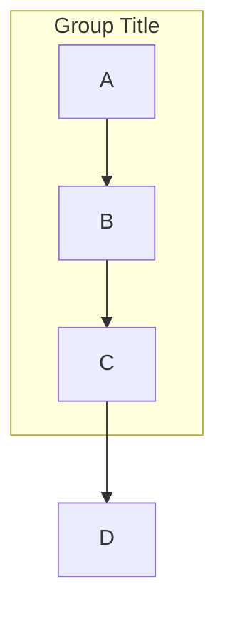
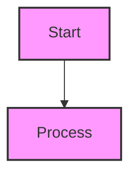
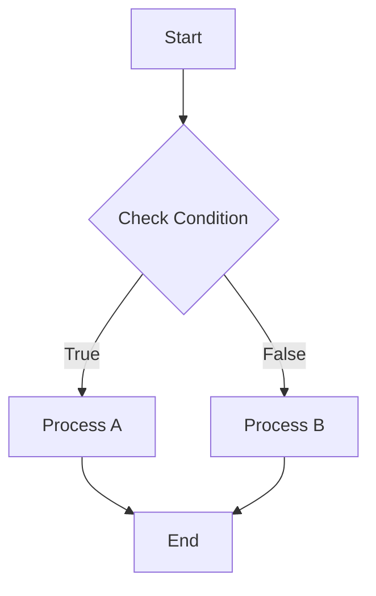
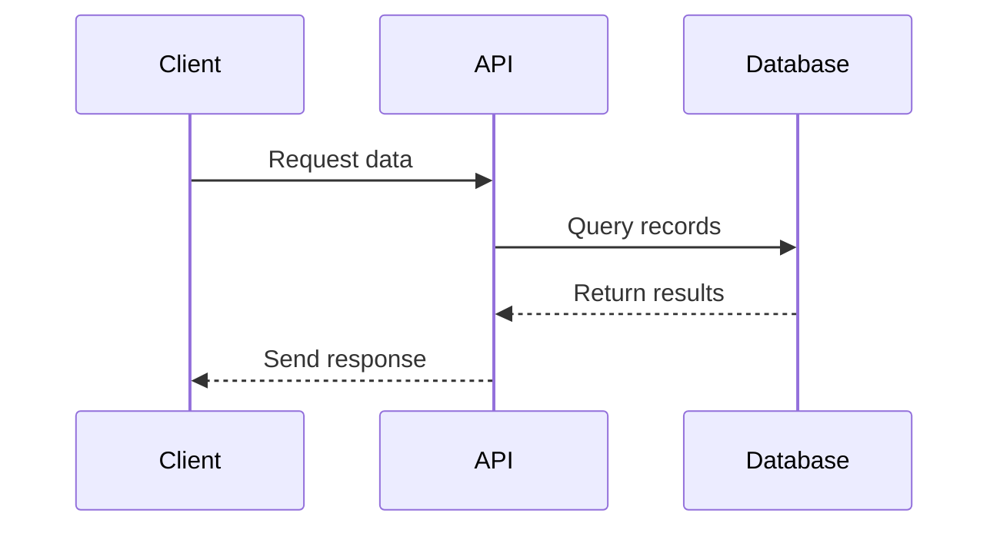
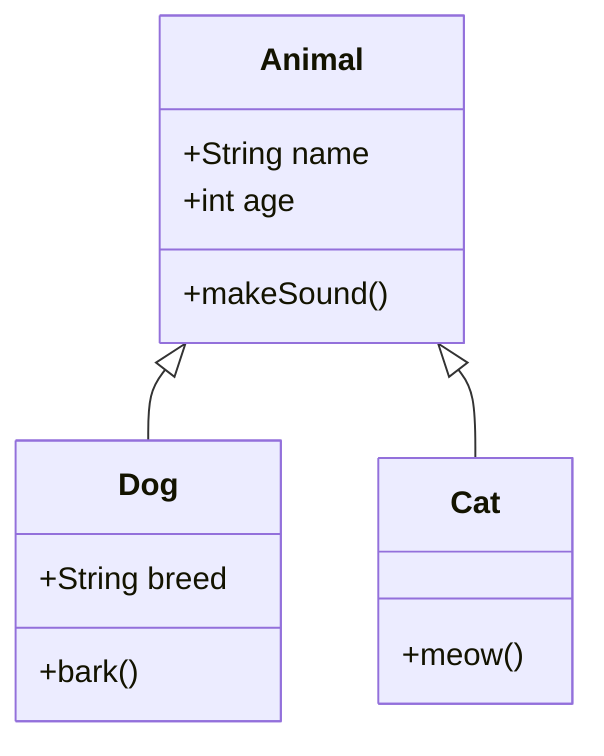

## Prerequisites

This skill requires `mmdc` (mermaid-cli) to be installed. If you don't have it installed, please run:

```bash
npm install -g @mermaid-js/mermaid-cli
```

**Quick Start:** The included `mermaid.sh` script provides a simple interface for validation without needing to remember complex mmdc commands.

## When to Use This Skill

When asked to create a Mermaid diagram, follow this workflow:

1. **Analyze the request** - Determine the most appropriate diagram type
2. **Generate clean Mermaid syntax**
3. **Validate the syntax** using temporary files or the provided script
4. **Present the validated diagram** with brief explanation

## Quick Start with Script

**Easiest Method:** Use the included `mermaid.sh` script!

The `mermaid.sh` script handles all temporary file creation, validation, and cleanup automatically.

```bash
# Create a temp diagram and validate
cat > ./tmp/diagram.mmd << 'EOF'
flowchart TD
    A[Start] --> B[End]
EOF
./mermaid.sh -f ./tmp/diagram.mmd
rm ./tmp/diagram.mmd

# Show help
./mermaid.sh --help
```

## Diagram Types

Choose the appropriate diagram type based on the use case:

- `flowchart`/`graph` - For processes and relationships
- `sequenceDiagram` - For interactions over time
- `classDiagram` - For software architecture and class relationships
- `gantt` - For project timelines and schedules
- `pie` - For data visualization and proportions
- `stateDiagram` - For state machines
- `erDiagram` - For entity relationships

## Mermaid Syntax Reference

### Node Syntax

```mermaid
A[Square/Rectangle]
B(Rounded rectangle)
C{Decision/Diamond}
D((Circle))
E>Flag/Asymmetric hexagon]
F{{Hexagon}}
G[/Parallelogram/]
H[\Parallelogram\]
I[[Subroutine]]
J[(Database)]
```

### Connection Syntax

```mermaid
A --> B              # Arrow
A -->|Text| B        # Arrow with label
A -.-> B             # Dotted arrow
A ==> B              # Thick arrow
A --- B              # Line (three dashes)
A -- Text --- B      # Line with text
A -.->|Text| B       # Dotted arrow with label
```

### Subgraphs



### Styling



### High Contrast Colors

**Prefer vivid, high contrast color combinations** for better readability and accessibility:

**Good High Contrast Examples:**


**Vivid Color Combinations with High Contrast:**
- Background: `#0066ff` (bright blue), Text: `#ffffff` (white)
- Background: `#cc0000` (vivid red), Text: `#ffffff` (white)
- Background: `#6600cc` (deep purple), Text: `#ffffff` (white)
- Background: `#00aa00` (vivid green), Text: `#ffffff` (white)
- Background: `#ff6600` (bright orange), Text: `#ffffff` (white)
- Background: `#ffdd00` (bright yellow), Text: `#000000` (black)
- Background: `#00cccc` (bright cyan), Text: `#000000` (black)
- Background: `#ff0099` (vivid magenta), Text: `#ffffff` (white)

**Avoid Low Contrast Combinations:**
- Background: `#cccccc` (light gray), Text: `#ffffff` (white)
- Background: `#f9f` (light pink), Text: `#fff` (white)
- Background: `#e0e0e0` (gray), Text: `#999999` (medium gray)
- Background: `#ffcccc` (pale red), Text: `#ffffff` (white)

## Validation Workflow

### Easiest Method: Use the Script

**Recommended:** Use the included `mermaid.sh` script with file validation:

```bash
# Create temp diagram in ./tmp
cat > ./tmp/diagram.mmd << 'EOF'
your mermaid code here
EOF
./mermaid.sh -f ./tmp/diagram.mmd
rm ./tmp/diagram.mmd
```

The script validates the diagram file and provides clear error messages. See "Quick Start with Script" section above for more examples.

### Manual Validation (For Advanced Users)

If you need to customize the validation process or understand how it works, see the advanced sections below:

#### Quick Validation Examples

Instead of writing complex bash scripts, simply create a temp file and validate:

```bash
# Create temp diagram and validate
cat > ./tmp/diagram.mmd << 'EOF'
graph TD
    A[Start] --> B[End]
EOF
./mermaid.sh -f ./tmp/diagram.mmd
rm ./tmp/diagram.mmd
```

## Common Errors and Fixes

### Syntax Issues

**Missing message text in sequence diagrams**
```mermaid
# ❌ WRONG - Missing message text
sequenceDiagram
    A->>B

# ✅ CORRECT - Include message
sequenceDiagram
    A->>B: Request data
    B->>A: Return response
```

**Invalid characters in node IDs**
- Use only letters, numbers, underscores: `node_1`, `nodeA`, `step2`
- Avoid spaces, hyphens in IDs: `my-node` (use `my_node` instead)

**Unclosed subgraphs**
```mermaid
# ❌ WRONG - Missing 'end'
subgraph Group
    A --> B

# ✅ CORRECT
subgraph Group
    A --> B
end
```

**Incorrect line syntax**
```mermaid
# ❌ WRONG - Two dashes don't work
A -- B

# ✅ CORRECT - Use three dashes
A --- B

# ✅ CORRECT - Arrow works with two dashes
A --> B
```

### Validation Issues

**Puppeteer/Chrome issues**
- mermaid-cli requires Puppeteer (includes Chrome)
- See [Linux sandbox issue](https://github.com/mermaid-js/mermaid-cli/blob/master/docs/linux-sandbox-issue.md)
- See [Docker permission denied issue](https://github.com/mermaid-js/mermaid-cli/blob/master/docs/docker-permission-denied.md)

**Using the script avoids these issues:**
The `mermaid.sh` script automatically handles temporary file creation with proper extensions, so you don't need to worry about file paths or extensions.

## Platform Compatibility Notes

### macOS vs Linux

**The `mermaid.sh` script works on both macOS and Linux** without any platform-specific code. It uses:

- Datetime-based temporary file naming (compatible with both platforms)
- Automatic cleanup with proper error suppression
- Portable bash syntax

**Platform-specific notes (for direct mmdc usage only):**
- ❌ GNU/Linux only: `mktemp --suffix=.mmd`
- ❌ Random suffixes: `mktemp ./tmp/mermaid.XXXXXX.mmd`
- ✅ Datetime-based naming: `./tmp/mermaid_$(date +%Y%m%d_%H%M%S).mmd`

**For most users:** Simply use the `mermaid.sh` script and these platform differences won't affect you.

## Example Workflows

### Creating a Flowchart

1. **Generate the diagram**:



2. **Validate using the script with a temp file**:

```bash
cat > ./tmp/flowchart.mmd << 'EOF'
flowchart TD
    A[Start] --> B{Check Condition}
    B -->|True| C[Process A]
    B -->|False| D[Process B]
    C --> E[End]
    D --> E
EOF

./mermaid.sh -f ./tmp/flowchart.mmd
rm ./tmp/flowchart.mmd
```

### Creating a Sequence Diagram



### Creating a Class Diagram



## Output Format

When presenting validated diagrams:

1. Provide the Mermaid code in a code block with \`\`\`mermaid
2. Include brief explanation of the diagram structure
3. Mention validation result: "✅ Valid Mermaid syntax"
4. For errors, the script will display the specific error message from mmdc

## Advanced: Direct mmdc Usage (For Custom Workflows)

If you need to use mmdc directly for custom workflows (e.g., generating specific output formats or using advanced configuration), here are the useful flags:

- `-i, --input <file>` - Input file (use `-` for stdin)
- `-o, --output <file>` - Output file (.svg, .png, .pdf, .md)
- `-t, --theme <theme>` - Theme (default, dark, forest, neutral)
- `-b, --backgroundColor <color>` - Background color (e.g., transparent, white, #f0f0f0)
- `-q, --quiet` - Suppress log output (useful for validation scripts)
- `-c, --configFile <file>` - JSON configuration file
- `--cssFile <file>` - Inline custom CSS

Example with options:
```bash
mmdc -i input.mmd -o output.png -t dark -b transparent -q
```

**Note:** For most use cases, the `mermaid.sh` script is simpler and handles temporary files automatically. Use direct mmdc commands only when you need specific output formats or advanced configuration.

## References

- [Official Mermaid CLI Documentation](https://github.com/mermaid-js/mermaid-cli)
- [Mermaid Syntax Guide](https://mermaid.js.org/syntax/)
- [Mermaid Live Editor](https://mermaid.live/) - Test diagrams in browser
