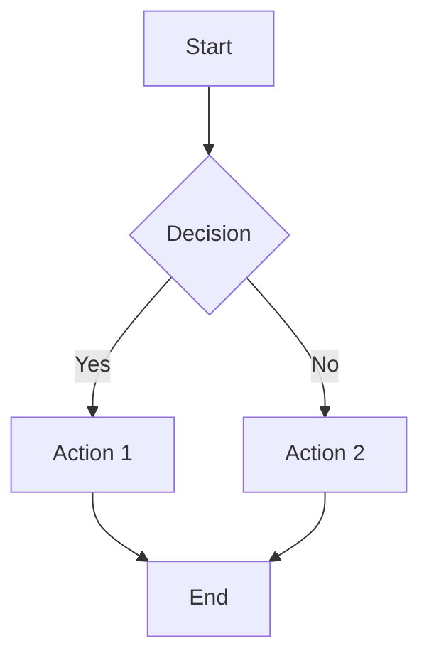
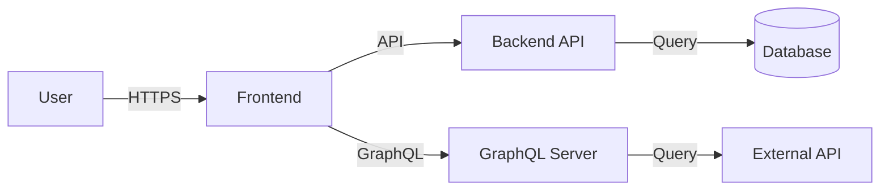
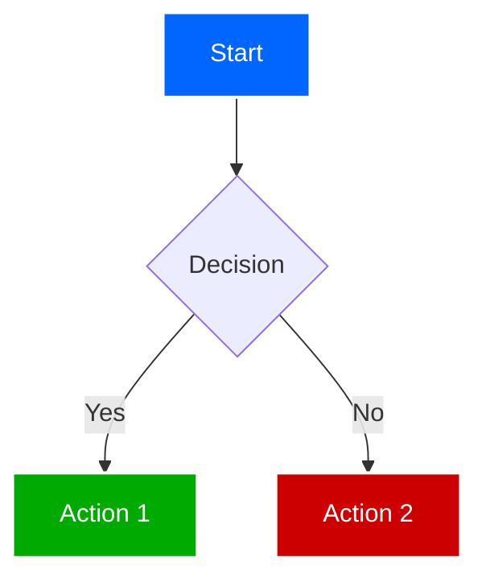
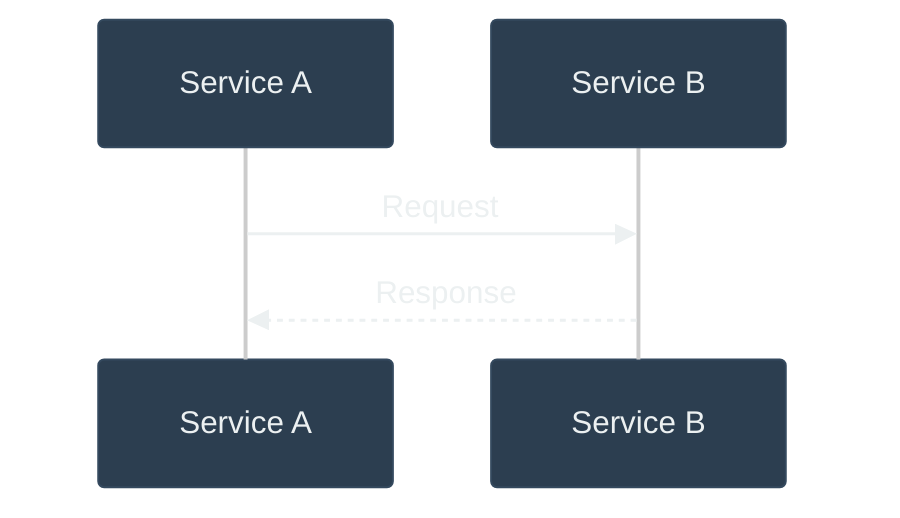
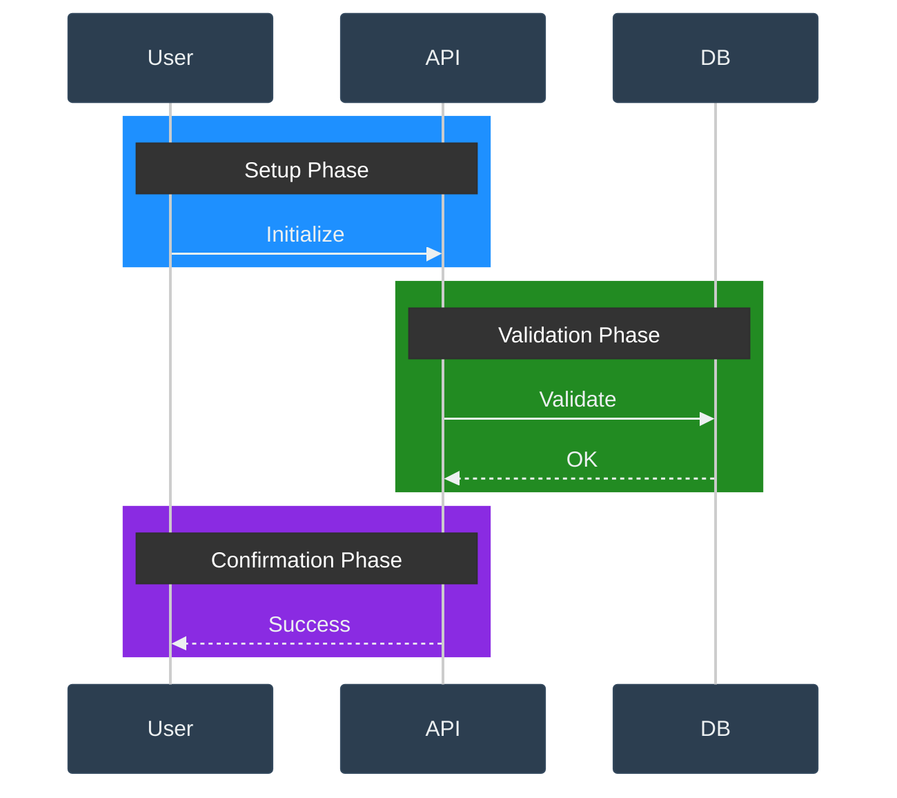

## Prerequisites

Install `mmdc` (mermaid-cli):

```bash
npm install -g @mermaid-js/mermaid-cli
```

**⚠️ ALWAYS USE `mermaid.sh` SCRIPT** - Never run `mmdc` directly. The script handles Chrome configuration to prevent permission prompts.

## Usage

Create and validate diagrams using the script:

```bash
# Validate from file
./mermaid.sh -f diagram.mmd

# Validate from argument
./mermaid.sh "flowchart TD; A --> B;"

# Validate from stdin
echo "graph TD; A --> B;" | ./mermaid.sh
```

## Diagram Types

### Flowchart Example


### Application Relationships Example


- `flowchart`/`graph` - Processes and relationships
- `sequenceDiagram` - Interactions over time
- `classDiagram` - Software architecture
- `gantt` - Project timelines
- `pie` - Data visualization
- `stateDiagram` - State machines
- `erDiagram` - Entity relationships

For syntax: [Mermaid Syntax Guide](https://mermaid.js.org/syntax/)

## Output Format

Present validated diagrams with:
1. Code block using \`\`\`mermaid
2. Brief explanation
3. "✅ Valid Mermaid syntax" confirmation

## Styling

Use **high contrast** colors for better readability:
- Black background
- White text
- Colored borders/connections
- Vivid colors for emphasis

Example styling:


## Dark Theme Configuration

For dark background editors (like Cursor), use this theme configuration:



### Recommended Stage Colors

For sequence diagrams with multiple stages, use these vivid colors:

```
rect rgb(30, 144, 255)     - DodgerBlue (Initial/Setup phase)
rect rgb(34, 139, 34)      - ForestGreen (Validation phase)
rect rgb(255, 140, 0)      - DarkOrange (Execution phase)
rect rgb(138, 43, 226)     - BlueViolet (Confirmation phase)
rect rgb(72, 61, 139)      - DarkSlateBlue (Polling/Waiting phase)
rect rgb(220, 20, 60)      - Crimson (Error/Exception handling)
```

Example usage:


## References

- [Official Mermaid CLI Documentation](https://github.com/mermaid-js/mermaid-cli)
- [Mermaid Syntax Guide](https://mermaid.js.org/syntax/)
- [Mermaid Live Editor](https://mermaid.live/) - Test diagrams in browser
